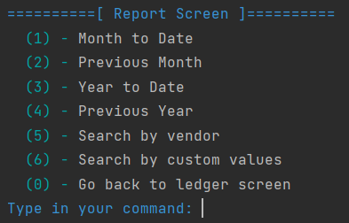

# AccountingLedger
A basic Accounting Ledger application that keeps track of transactions. Transactions are saved in a `transactions.csv` file in a `YYYY-MM-DD|HH:MM:SS|Description|Vendor|Price` format.
Since transactions are saved to a file then the application also have the ability to load from the `transactions.csv` file. The application comes with built-in screen that provide useful
functionality in terms of displaying, filtering, sorting, and statistics.

## Menus
There are four core screens, along with some sub-screens.

### Core Menu - Main Screen

The Main Screen is basic and has four options - Add a deposit, Make a deposit, View your ledger, and exiting the program.
The images folder of the project repository contains pictures of the different Main Screen options as the program runs.

### Core Menu - Ledger Screen

The Ledger Screen has the options to - Display all ledger posts, Display only deposits, Display only payments, Filter ledger by pre-defined values,
View Your Ledger Statistics, and going back to the home menu.
The images folder of the project repository contains pictures of the different Ledger Screen options as the program runs.

### Core Menu - Reports Screen

The Report screen has the options to Filter and sort by - month to date, previous month, year to date, previous year, search by vendor, search by custom values, go back to ledger screen.
The images folder of the project repository contains pictures of the different Report Screen options as the program runs.

### Core Menu - Statistics Screen

The Statistic Screen was an additional feature that feels useful. It can calculate your ledgers total balance, monthly summary, yearly summary, detailed yearly summary, debt to income ratio, and going back to ledger screen
The images folder of the project repository contains pictures of the different Statistic Screen options as the program runs.

## Interesting Pieces of Code

An interesting piece of code was the Terminal class. This classes job was to use the terminal escape codes to change text to different colors. By putting the codes in an Enum and then creating static helper methods the class was modular and could print to the terminal in many colors. The images shows an example of this as it can print a menu in color and customize different parts of it.
